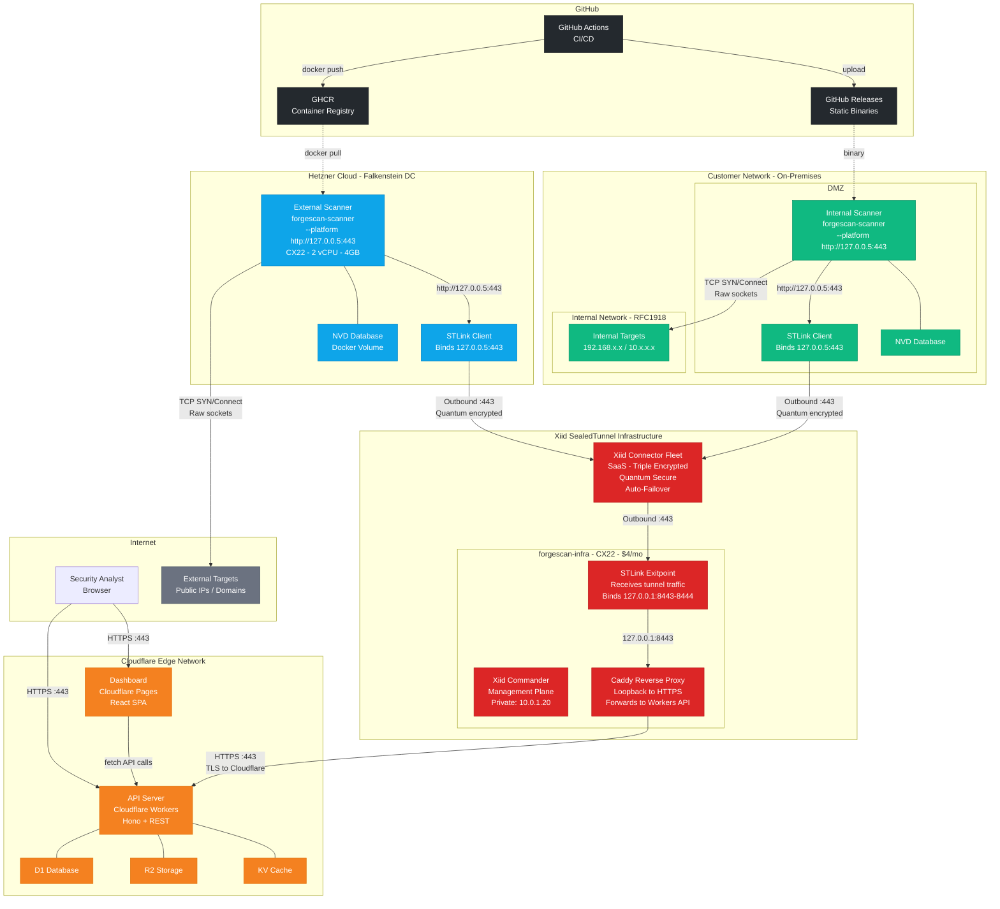

# ForgeScan 360 — Hybrid Scanning Architecture

> Cloudflare Edge + Xiid SealedTunnel + Hetzner External Scanner + On-Prem Internal Scanner

## Overview

ForgeScan 360 uses a **hybrid deployment model** with cloud-hosted management (Cloudflare), distributed scanner nodes, and **Xiid SealedTunnel** for quantum-resistant, zero-inbound-port secure communication between all components.

**Key design principles:**
- **Zero inbound ports** — all connections outbound-only on port 443
- **Xiid SealedTunnel** provides triple-encrypted, quantum-secure transport
- Scanner connects to local STLink loopback (`http://127.0.0.5:443`) — STLink handles encryption
- Caddy exitpoint proxies tunnel traffic to Cloudflare Workers API
- Scanner authentication via `X-Scanner-Key` header (separate from user JWT)
- NVD vulnerability database is **local** to each scanner
- **Zero code changes** to scanner — STLink is transparent at the network layer
- Backward compatible — SealedTunnel is opt-in via `--use-sealedtunnel` flag

## Network Diagram



## Data Flow

1. Scanner starts with `--platform http://127.0.0.5:443`
2. `reqwest` sends `POST http://127.0.0.5:443/api/v1/scanner/heartbeat` (plain HTTP to loopback)
3. STLink intercepts traffic at `127.0.0.5:443`, encrypts (quantum-resistant)
4. STLink sends outbound :443 to Xiid Connector Fleet
5. Connector Fleet routes to exitpoint's STLink on `forgescan-infra` VM
6. STLink exitpoint decrypts, delivers to `127.0.0.1:8443`
7. Caddy receives, re-encrypts with TLS, forwards to `https://forgescan-api.stanley-riley.workers.dev`
8. Workers API processes request, response returns through the same path

**Why HTTP to loopback?** STLink provides encryption. Using HTTPS would be unnecessary double-encryption. The `X-Scanner-Key` header on loopback never leaves the machine.

## Component Details

### Cloudflare Edge (Management Plane)

| Component | Service | Purpose |
|-----------|---------|---------|
| **Workers API** | Hono + REST | Scanner task queue, result ingestion |
| **Pages Dashboard** | React SPA | Security analyst interface |
| **D1** | SQLite | Scans, tasks, findings, assets |
| **R2** | Object Storage | PDF reports, CSV exports |
| **KV** | Key-Value | Sessions, NVD metadata cache |

### Xiid SealedTunnel Infrastructure

| Component | VM | Purpose |
|-----------|-----|---------|
| **Xiid Commander** | forgescan-infra (CX22) | Tunnel management, mapping config, private IP 10.0.1.20 |
| **STLink Exitpoint** | forgescan-infra (CX22) | Receives tunnel traffic, binds 127.0.0.1:8443-8444 |
| **Caddy** | forgescan-infra (CX22) | Reverse proxy: loopback to Cloudflare Workers HTTPS |
| **Connector Fleet** | Xiid SaaS | Triple-encrypted bridge, quantum secure, auto-failover |

### Tunnel Mapping Table

| Tunnel | Scanner Side Bind | Exitpoint Side Bind | Purpose |
|--------|------------------|--------------------|---------|
| `fs-ext-to-platform` | `127.0.0.5:443` on scanner VM | `127.0.0.1:8443` on infra VM | External scanner to API |
| `fs-onprem-to-platform` | `127.0.0.5:443` on customer host | `127.0.0.1:8444` on infra VM | On-prem scanner to API |

### Hetzner Cloud

| VM | Spec | Cost | Role |
|----|------|------|------|
| `forgescan-scanner-ext` | CX22, 2 vCPU, 4 GB, 40 GB | ~$4/mo | Scanner + STLink client |
| `forgescan-infra` | CX22, 2 vCPU, 4 GB, 40 GB | ~$4/mo | Commander + exitpoint + Caddy |
| **Total** | | **~$8/mo** | |

## Security Model

1. **Zero inbound ports** — All connections outbound-only on port 443 (post-lockdown)
2. **Quantum-resistant encryption** — Xiid SealedTunnel triple-encrypted transport
3. **No VPN required** — STLink replaces traditional VPN with zero-trust tunnels
4. **Separate auth** — Scanner API keys (`X-Scanner-Key`) independent of user JWT
5. **Least privilege** — Scanner runs as non-root `forgescan` user with only NET_RAW/NET_ADMIN caps
6. **Credential isolation** — API keys in env files (mode 600) or machine environment variables
7. **NVD locality** — Vulnerability database local to each scanner, no external API calls
8. **Commander isolation** — Management plane bound to private IP (10.0.1.20) on isolated VLAN
9. **Post-lockdown** — After setup, remove SSH access; manage everything through SealedTunnel

## Quick Start

### External Scanner (Hetzner + SealedTunnel)

```bash
./deploy/hetzner/install.sh \
  --api-key <KEY> --scanner-id <ID> \
  --use-sealedtunnel --stlink-config /path/to/stlink.json
```

### Internal Scanner (Linux + SealedTunnel)

```bash
./deploy/onprem/install.sh \
  --api-key <KEY> --scanner-id <ID> \
  --use-sealedtunnel --stlink-config /path/to/stlink.json
```

### Internal Scanner (Windows + SealedTunnel)

```powershell
.\install-windows.ps1 -ApiKey "sk_xxx" -ScannerId "scan_xxx" `
  -UseSealedTunnel -StLinkConfigPath "C:\path\to\stlink.json"
```

### Direct Mode (No SealedTunnel)

```bash
./deploy/hetzner/install.sh --api-key <KEY> --scanner-id <ID>
```
