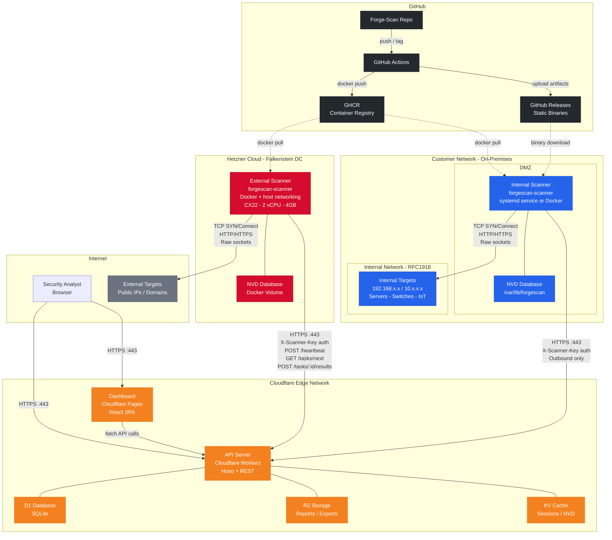

# ForgeScan 360 — Hybrid Scanning Architecture

> Cloudflare Edge + Hetzner External Scanner + On-Prem Internal Scanner

## Overview

ForgeScan 360 uses a **hybrid deployment model** that combines cloud-hosted management (Cloudflare) with distributed scanner nodes. External scanners run on Hetzner Cloud VPS (~$4/mo), while internal scanners deploy as native binaries or Docker containers inside customer networks.

**Key design principles:**
- All scanner connections are **outbound-only** (HTTPS port 443)
- No VPN, no inbound ports, no firewall rules needed
- Scanner authentication via `X-Scanner-Key` header (separate from user JWT)
- NVD vulnerability database is **local** to each scanner (no runtime API calls)
- Scanners poll the platform for tasks — no push mechanism required

## Network Diagram



## Component Details

### Cloudflare Edge (Management Plane)

| Component | Service | Purpose |
|-----------|---------|---------|
| **Workers API** | Hono + REST | Scanner task queue, result ingestion, auth |
| **Pages Dashboard** | React SPA | Security analyst interface |
| **D1** | SQLite | Scans, tasks, findings, assets |
| **R2** | Object Storage | PDF reports, CSV exports |
| **KV** | Key-Value Cache | Sessions, NVD metadata cache |

**API Endpoints (Scanner-facing):**
- `POST /api/v1/scanners/heartbeat` — Scanner health check + status
- `GET /api/v1/tasks/next` — Poll for next assigned task
- `POST /api/v1/tasks/:id/start` — Mark task as running
- `POST /api/v1/tasks/:id/results` — Submit scan results (findings, assets, ports)
- `POST /api/v1/tasks/:id/failure` — Report task failure

### Hetzner Cloud (External Scanner)

| Spec | Value |
|------|-------|
| **Server** | CX22 (shared) |
| **Cost** | ~$3.99/mo |
| **CPU** | 2 vCPU (AMD EPYC) |
| **RAM** | 4 GB |
| **Disk** | 40 GB NVMe |
| **OS** | Ubuntu 22.04 LTS |
| **Runtime** | Docker + host networking |
| **Capabilities** | NET_RAW, NET_ADMIN |

**Docker run flags:**
```bash
docker run --network host \
  --cap-add NET_RAW --cap-add NET_ADMIN \
  -v forgescan-nvd:/var/lib/forgescan \
  ghcr.io/bjay0727-jay/forgescan-scanner:latest \
  --platform https://forgescan-api.stanley-riley.workers.dev
```

### Customer On-Premises (Internal Scanner)

| Deployment | Method |
|------------|--------|
| **Linux** | Native binary + systemd service |
| **Linux (Docker)** | Same image as Hetzner, `--network host` |
| **Windows** | Native binary + Windows Service |

**Systemd capabilities (non-root):**
```ini
AmbientCapabilities=CAP_NET_RAW CAP_NET_ADMIN
CapabilityBoundingSet=CAP_NET_RAW CAP_NET_ADMIN
```

### CI/CD Pipeline (GitHub Actions)

| Workflow | Trigger | Output |
|----------|---------|--------|
| **ci.yml** | Pull requests | fmt + clippy + test |
| **build-docker.yml** | Push to main / tags | Multi-arch Docker image → GHCR |
| **release-binaries.yml** | Version tags (v*) | Cross-compiled binaries → GitHub Releases |

**Targets:**
- `x86_64-unknown-linux-gnu` (amd64)
- `aarch64-unknown-linux-gnu` (arm64)
- `x86_64-pc-windows-gnu` (Windows)

## Security Model

1. **No inbound ports** — Scanners only make outbound HTTPS connections
2. **Separate auth** — Scanner API keys (`X-Scanner-Key`) are independent of user JWT tokens
3. **Least privilege** — Scanner runs as non-root `forgescan` user with only NET_RAW/NET_ADMIN caps
4. **Credential isolation** — API keys stored in env files (mode 600) or machine environment variables
5. **NVD locality** — Vulnerability database is local to each scanner; no external NVD API calls during scans
6. **TLS everywhere** — All scanner-to-platform communication is HTTPS with certificate validation

## Quick Start

### External Scanner (Hetzner)

```bash
# On a fresh Hetzner CX22 VPS
curl -fsSL https://raw.githubusercontent.com/Bjay0727-jay/Forge-Scan/main/deploy/hetzner/install.sh | \
  sudo bash -s -- --api-key <KEY> --scanner-id <ID>
```

### Internal Scanner (Linux)

```bash
curl -fsSL https://raw.githubusercontent.com/Bjay0727-jay/Forge-Scan/main/deploy/onprem/install.sh | \
  sudo bash -s -- --api-key <KEY> --scanner-id <ID>
```

### Internal Scanner (Windows)

```powershell
.\install-windows.ps1 -ApiKey "sk_scanner_xxx" -ScannerId "scan_xxx"
```
